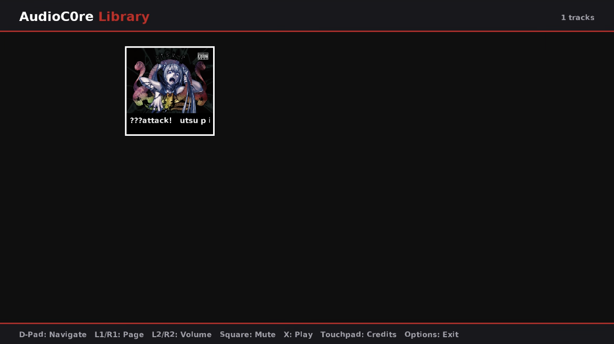
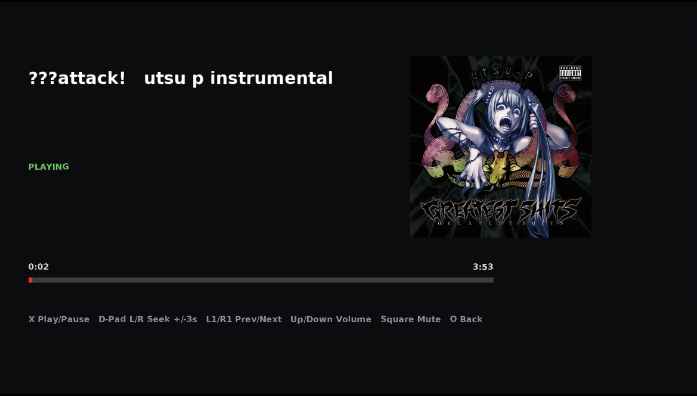
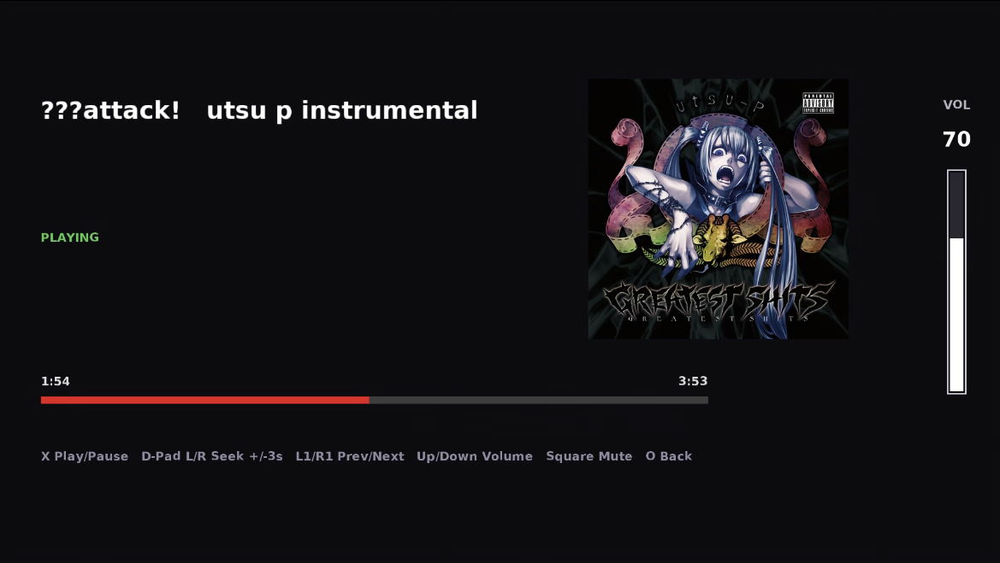
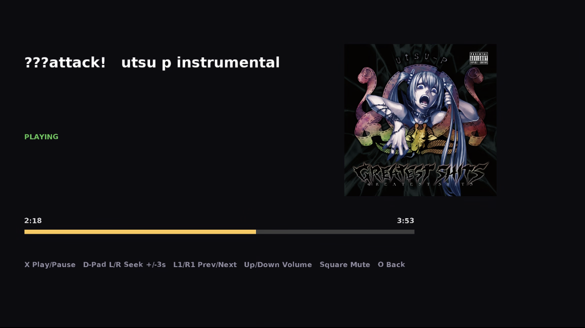

# AudioC0re

A music browser and player on PS4/PS5 via LuaC0re...

---
## Screenshots



<details>
<summary>More Screenshots</summary>



---



---



</details>

---
## Note
* This project structure is taken by another secret project I am working on for later.

---
## Controls Map

| Button | Function |
| ------ | -------- |
| Cross (X) | Select in menu, Pause/Play or use after skipping time in player or Skip intro |
| Circle (O) | Back |
| D-Pad | Negative (menu) skip backward/forward (Player) and Up/Down in player controls volume up or down | Options | Quit to luac0re (in menu |

---
## Requirements

- **Console**: PS4 or PS5 with LuaC0re working (Star Wars Racer
  Revenge exploit chain).
- **PC / Phone**: Python 3.8 or newer with `Pillow` and `PyYAML`.
  `ffmpeg` is required for audio conversion and embedded art (that's for pc building only)
  extraction.
- **Network**: console and PC on the same LAN. The launcher
  auto-detects your PC's IP.

---
## How to build?

### Using GitHub YML

1. First of all put your music files into music/
2. you can put cover in covers/ but it's not required , also if your audio file has a cover image it'll take it anyway
3. go to action and the build YML and hit run.
4. when it finishes take the bundled and copy it to the folder you placed the python and lua at and unpack the zip file and the second zip file until you get a bundle folder output and keep it as it is
5. use Python and change up to your console ip and finally run it

**Note** - Make sure both audio file and cover files have same name so they find each others 


## Using PC

1. Build the shellcode

```bash
bash build.sh
```

2. Add your music

```
music/     ← drop .mp3 / .flac / .wav / .m4a / .ogg / .opus here
covers/    ← matching .jpg / .png with the same filename stem
image/     ← logo.png, loading.png, default.png (any size)
```

Example:

```
music/
    Exp1.mp3
    Exp2.flac
covers/
    Exp1.jpg
    Exp2.png
```

The builder matches music/foo.mp3 to covers/foo.jpg by the
filename stem (everything before the extension), case-insensitive.

3. Build the library

```bash
python3 tools/build_library.py
```

This writes everything to out/. It converts audio to raw PCM,
covers to 500×500 BGRA, and produces manifest.bin.

4. Send it to the console

```bash
python3 audioC0re_launcher.py <PS5_IP>
```

## The launcher:

1. Sends the Lua payload to the console's remote Lua loader via Python..
3. Waits for the shellcode to open its library port.
4. Transfers the library over TCP.

the python does it all btw.. so dw


---

## About library.yaml
.. this .. finds the data of the audio and extract it like artist, name, cover image, etc.

---

## Folder Structure

```
AudioC0re/
├── src/                      C source for the shellcode
├── music/                    your audio files
├── covers/                   your cover images
├── image/                    logo.png, loading.png, default.png
├── tools/
│   ├── bake_font.py
│   ├── bake_ui_assets.py
│   └── build_library.py
├── out/                      generated library (gitignored)
├── library.yaml              optional metadata overrides
├── audioC0re.lua             LuaC0re payload
├── audioC0re_launcher.py     PC / phone launcher
├── linker.ld
├── Makefile
├── build.sh
└── .github/workflows/build.yml
```

---

Manifest Format

manifest.bin is the binary file the console reads. If you ever want to generate it yourself, here's the layout.

Header — 32 bytes, little-endian

```
0x00  char[4]   magic    "AC0R"
0x04  u32       version  = 2
0x08  u32       count
0x0C  u32       cover_w
0x10  u32       cover_h
0x14  u32       strtab_off
0x18  u32       strtab_size
0x1C  u32       reserved
```

Entry — 40 bytes each

```
0x00  u32  title_off
0x04  u32  artist_off
0x08  u32  album_off
0x0C  u32  cover_off
0x10  u32  audio_off
0x14  u32  duration_ms
0x18  u32  added_ts
0x1C  u32  sort_key
0x20  u32  flags
0x24  u32  reserved
```

All offsets point into the string table at strtab_off

---
## Error listening
- Error memory full please restart.. only happen when you quit and then resend the payload again. because of that you're out of memory already so the music player won't function well. so I added that error to prevent this from happening. please reboot the game each time you wanna relaunch the bin after exiting it.

---

## Credits

* MexrlDev — Developer / Programmer / Debugging

 **Special Thanks**
  - [Egycnq](https://github.com/egycnq) — for EmuC0re / DooMC0re researches.
  - [Gezine](https://github.com/Gezine) — for LuaC0re.

---

License

MIT. See LICENSE.

---
In memory of MexrlDev PsVue-Mod Project.
